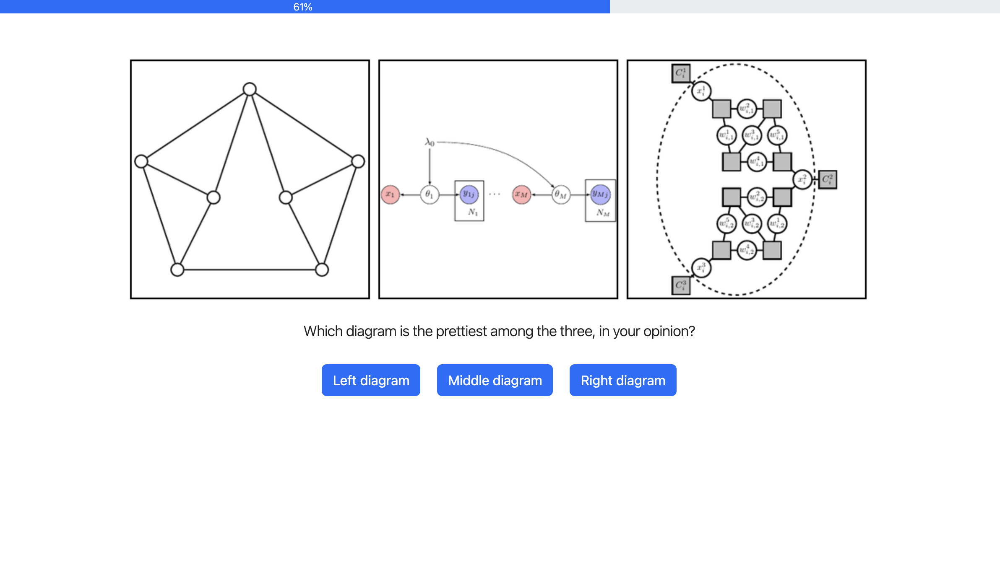

# Tasks

## Task 1 - Adaptive expertise assessment

## Task 2 - Subjective comparison

3,000 images, 6,000 triplets, 5 trials per triplet (30,000 total, 15,000 per block).
125 trials per participant (120 participants needed for the completion of the first block, and 240 for both blocks)

## Task 3 - Subjective rating

3,000 images, 5 trials per image (15,000 total).
75 trials per participant (200 participants needed for completion)

